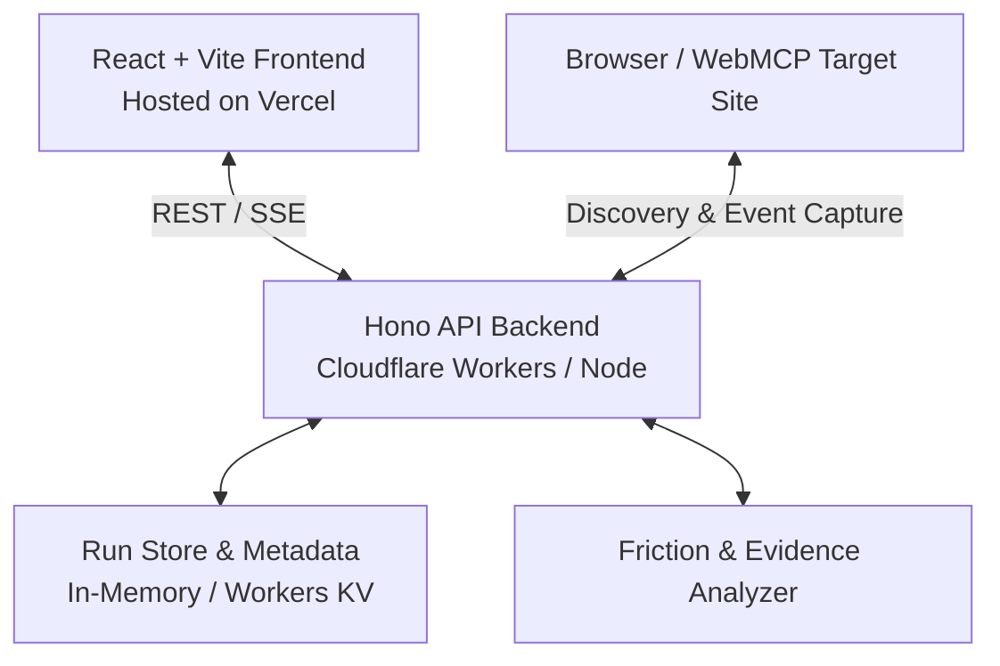

# Deep Age

> **Test-drive any website as an AI agent.**
> Observability, Friction Diagnostics, and WebMCP Inspection Layer for Web Agents.

---

## 🌟 What is Deep Age?

The goal is **not** to build another browser or another chatbot.
The goal is: **Understand what actually happens when an AI agent tries to use a website.**

When an AI agent interacts with a web page, things frequently break in subtle ways:
- The website has an API (e.g. `POST /api/cart`) and a DOM button, but **never registered a WebMCP tool** for agents to programmatically add items to cart.
- Input schemas might be ambiguous or invalid.
- Critical actions fail silently or leak private data across third-party trackers.

**Deep Age** sits between the agent and the target website, capturing multi-modal evidence across:
- **WebMCP capabilities & schemas** (`window.modelContext` / `document.modelContext`)
- **Tool calls, inputs, outputs, and errors**
- **Network requests, responses, status codes, and latency**
- **DOM elements, visible controls, and interactions**
- **Console & runtime errors**
- **Agent friction points & security observations**

---

## 🎭 Three User Modes

Deep Age provides three distinct views over the same underlying evidence:

```
                          ┌──────────────────────────┐
                          │ Deep Age Evidence Engine │
                          └─────────────┬────────────┘
                                        │
             ┌──────────────────────────┼──────────────────────────┐
             ▼                          ▼                          ▼
   ┌───────────────────┐      ┌───────────────────┐      ┌───────────────────┐
   │  1. Explore       │      │  2. Debug         │      │  3. Inspect       │
   │  (Normal User)    │      │  (Dev / PM)       │      │  (Security User)  │
   ├───────────────────┤      ├───────────────────┤      ├───────────────────┤
   │ Plain-English     │      │ Full technical    │      │ Contacted hosts,  │
   │ explanation of    │      │ trace, WebMCP,    │      │ 3rd party I/O,    │
   │ what happened and │      │ network I/O,      │      │ payload leakage,  │
   │ why it happened.  │      │ friction & fixes. │      │ security signals. │
   └───────────────────┘      └───────────────────┘      └───────────────────┘
```

1. **Explore (Normal User)**:
   * *“Why did checkout fail?”* / *“Where did this price come from?”*
   * Delivers a plain-English explanation first, with optional drill-downs.
2. **Debug (Product Owner / Developer)**:
   * *“Why couldn't the agent add the laptop to the cart?”*
   * Pinpoints exact technical evidence: `POST /api/cart` exists, but no `add_to_cart` WebMCP tool was discovered.
   * Delivers concrete recommendations: `document.modelContext.registerTool({ name: "add_to_cart", ... })`.
3. **Inspect (Security User)**:
   * *“What information does this website send externally?”*
   * Reports factual observations: 3rd-party domains contacted, redirects, unencrypted HTTP transmissions, and payload data flows.

---

## 🏗️ Architecture



- **Headless Browser Execution Engine (`backend/src/engine/agent-runner.ts`)**: Uses real Chromium instances (via Puppeteer) to navigate live target URLs, intercept actual network traffic, inspect live DOM controls, and discover/execute tools registered in `window.modelContext` / `document.modelContext`.
- **Frontend (`frontend/`)**: React 18, Vite, Tailwind CSS, Lucide icons. Provides interactive start screen and detailed real-time evidence viewer.
- **Backend (`backend/`)**: Hono API framework. Manages test-drive lifecycle, real browser orchestration, and heuristic friction analysis.
- **Target Demo Store (`demo/`)**: Controlled real e-commerce store with live WebMCP tools and interactive friction toggle.

---

## 🚀 Quickstart

### Prerequisites
- Node.js `>= 20.x`
- npm `>= 10.x`

### 1. Install Dependencies
```bash
npm install
```

### 2. Build All Packages
```bash
npm run build
```

### 3. Run Real Live Browser Verification Test (Zero Mock Data)
```bash
npm test
```

This performs a 100% live test:
1. Boots the real e-commerce store HTTP server.
2. Launches headless Chromium to visit the live store.
3. Live DOM inspection discovers registered WebMCP tools (`search_products`, `filter_products`, `get_product_details`).
4. Intercepts live network requests and detects that `add_to_cart` WebMCP tool is missing despite `POST /api/cart` existing.
5. Flags real agent friction and generates fix recommendations.
6. Toggles the live site to expose `add_to_cart` and re-runs the real browser test.
7. Discovers `add_to_cart`, executes the live tool inside the page context, executes `POST /api/cart`, and confirms task completion with 0 friction!

---

## 💻 Running the Services Locally

You can launch each service in separate terminals:

### Start Backend API (Port 3001)
```bash
npm run dev:backend
```

### Start Frontend UI (Port 5173)
```bash
npm run dev:frontend
```

### Start Demo E-Commerce Target (Port 3002)
```bash
npm run dev:demo
```

Open [http://localhost:5173](http://localhost:5173) in your browser to launch Deep Age!

---

## 📂 Project Structure

```
Deep-dream/
├── shared/                 # Shared TypeScript interfaces & models
│   └── src/index.ts        # WebMCP, Run, Friction, & Security types
├── backend/                # Hono API & Analysis Engine
│   ├── src/app.ts          # REST endpoints (runs, events, simulation)
│   ├── src/analyzer.ts     # Multi-mode evidence analyzer & friction heuristics
│   ├── src/store.ts        # In-memory / Cloudflare KV run store
│   └── src/test-agent-sim.ts # Verification test suite
├── frontend/               # React + Vite + Tailwind UI
│   ├── src/App.tsx         # Start screen & multi-mode result explorer
│   └── src/main.tsx
├── demo/                   # Controlled WebMCP target store
│   └── src/index.ts        # Mock store with WebMCP registration & toggle
└── docs/                   # Architecture & specifications
```

---

## 📋 Phase 0 Deliverables Summary

- [x] **Monorepo setup**: Clean TypeScript monorepo with `shared`, `backend`, `frontend`, and `demo`.
- [x] **WebMCP Contract & Simulator**: Ingests tool registrations, execution traces, DOM elements, and network events.
- [x] **Friction Analysis Engine**: Detects missing WebMCP capabilities, tool failures, network issues, and security signals.
- [x] **Multi-Mode UI**: Unified interface supporting **Explore**, **Debug**, and **Inspect** modes.
- [x] **Controlled Demo Site**: Realistic e-commerce store with WebMCP tools and interactive friction toggle.
- [x] **Automated Verification**: End-to-end test script proving tool discovery, friction detection, and fix verification.