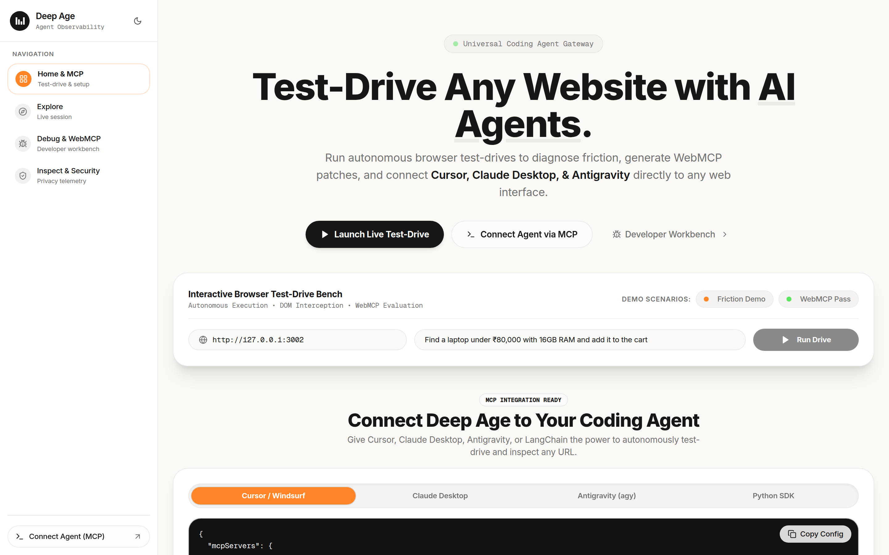
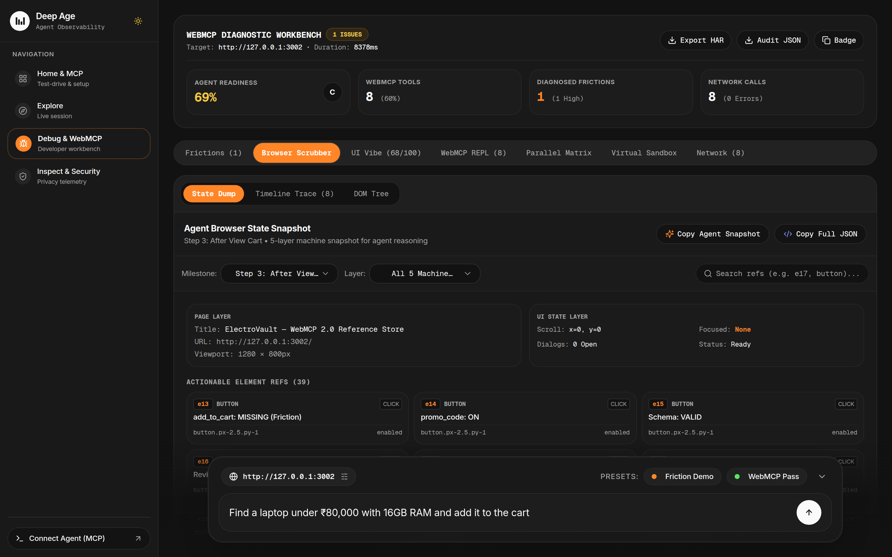

# Deep Age

> **Test-drive any website as an AI agent.**
> Observability, Friction Diagnostics, and WebMCP Inspection Layer for Autonomous Web Agents across **all web domains** (3D Viewports, Documentation Hubs, SaaS Dashboards, Creative Canvas Tools, and Web Stores).

[-emerald?style=flat-square&logo=googlechrome)](https://github.com/Viswesh934/Deep-Age)
[](https://opensource.org/licenses/MIT)
[](https://www.typescriptlang.org/)
[](https://modelcontextprotocol.io/)

---

## 🌟 What is Deep Age?

The goal is **not** to build another browser or another chatbot.  
The goal is: **Understand what actually happens when an AI agent tries to use any website.**

When an autonomous AI agent interacts with a web page, things frequently break in subtle ways:
- The website has internal state and DOM buttons, but **never registered WebMCP tools** (`window.modelContext` / `document.modelContext`) for agents to execute actions programmatically.
- Input schemas are missing, ambiguous, or fail validation.
- Critical actions fail silently, throw runtime exceptions, or leak private data across third-party trackers.
- UI elements lack stable semantic element references (`ref: e1`, `ref: e17`) needed for reliable agent action planning.

**Deep Age** sits between the agent and the target website, capturing multi-modal evidence across:
- **WebMCP Capabilities & JSON Schemas** (`window.modelContext` / `document.modelContext`)
- **5-Layer Browser State Machine** (Page, UI State, Semantic Tree, Interaction State with Element Refs, Environment)
- **DOM Component Tree & Interactive Controls**
- **Universal Multi-Domain Intent Planning** (3D Modeling, Docs, Canvas, SaaS, Media, and E-Commerce)
- **Real-Time Network Packets, Latency, and Status Codes**
- **Friction Diagnostics & Instant Drop-in Remediation Patches**
- **Security Firewall: Indirect Prompt Injection Defense & Client-Side PII Masking**
- **Portable SQLite Knowledge Graph Export**

---

## 📸 Interface Preview

<div align="center">
  
  <p><em>Deep Age Interactive Agent Test-Drive Bench & MCP Gateway</em></p>
</div>

<div align="center">
  
  <p><em>5-Layer Browser State Scrubber & Actionable Element Refs (e1–e39)</em></p>
</div>

---

## 🌐 Live Remote MCP Server (Windows / macOS / Linux)

Deep Age provides a cloud-hosted, cross-platform **Remote SSE MCP Endpoint** that connects directly over HTTPS without local process spawning issues:

```json
{
  "mcpServers": {
    "deep-age": {
      "url": "https://deep-age-backend.sigireddyviswesh.workers.dev/mcp",
      "type": "sse",
      "description": "Deep Age — WebMCP Diagnostics & Autonomous Observability"
    }
  }
}
```

> **Windows Compatibility**: Using `type: "sse"` avoids Windows PowerShell pipe escaping and `npx` child process spawn limitations. It runs out of the box on Windows, Linux, and macOS in **Cursor**, **Claude Desktop**, **Windsurf**, **Cline**, and **Antigravity**.

---

## 🧰 Available MCP Tools

AI coding agents have access to 8 native tools:

| MCP Tool | Description | Parameters |
| :--- | :--- | :--- |
| **`deep_age_test_drive`** | Dispatches a headless browser agent to any website, discovers in-page WebMCP tools, runs autonomous multi-step tasks, captures live network I/O, records 5-layer state snapshots, and generates drop-in code fixes. | `url`: string<br>`task`: string<br>`mode`: `"debug"` \| `"explore"` \| `"inspect"` |
| **`deep_age_export_sqlite`** | Exports the website's catalog, metadata, routes, and knowledge graph as a runnable SQLite `.sql` database script. | `url`: string |
| **`deep_age_get_state_graph`** | Extracts the dynamic state transition relation graph of reachable page routes and required WebMCP tool transitions. | `url`: string<br>`id`: string (optional) |
| **`deep_age_get_dom_tree`** | Extracts the structured DOM relation tree and accessibility semantic hierarchy with interactive selectors, aria-roles, and bound WebMCP actions. | `url`: string (optional)<br>`id`: string (optional) |
| **`deep_age_get_state_dumps`** | Retrieves chronological 5-layer browser state dumps across execution milestones (`PageLayer`, `UIStateLayer`, `SemanticTreeLayer`, `WebMCPLayer`, `ExecutionLayer`). | `id`: string |
| **`deep_age_scan_security`** | Scans inputs or website content for indirect prompt injections, adversarial overrides, and masks sensitive PII (credit cards, SSNs, emails, phone numbers). | `text`: string |
| **`deep_age_inspect_webmcp`** | Rapidly queries in-page WebMCP tool declarations and JSON Schemas in `window.modelContext` / `document.modelContext`. | `url`: string |
| **`deep_age_get_run`** | Fetches the complete run evidence dossier by ID (including base64 screenshots, HAR network log, and timeline). | `id`: string |

---

## 🧠 Universal Multi-Domain Support

Deep Age is completely domain-agnostic and plans actions for any web application archetype:

- **3D Modeling & CAD Tools** (Three.js, Spline, Blender Web): `rotate_camera`, `render_mesh`, `extrude_polygon`, `export_obj`
- **Documentation & Knowledge Portals** (e.g. `https://margin-local-docs.openai.chatgpt.site/`): `search_docs`, `read_section`, `extract_code`, `list_endpoints`
- **Developer Consoles & SaaS Platforms**: `run_query`, `filter_logs`, `create_resource`, `update_setting`
- **Creative Canvas & Media Editors**: `synthesize_audio`, `draw_path`, `apply_filter`, `export_canvas`
- **E-Commerce & Marketplaces**: `search_products`, `get_details`, `add_to_cart`, `apply_promo_code`

---

## 🎭 Three User Modes

```
                          ┌──────────────────────────┐
                          │ Deep Age Evidence Engine │
                          └─────────────┬────────────┘
                                        │
             ┌──────────────────────────┼──────────────────────────┐
             ▼                          ▼                          ▼
   ┌───────────────────┐      ┌───────────────────┐      ┌───────────────────┐
   │  1. Explore       │      │  2. Debug         │      │  3. Inspect       │
   │  (Normal User)    │      │  (Dev / PM)       │      │  (Security User)  │
   ├───────────────────┤      ├───────────────────┤      ├───────────────────┤
   │ Plain-English     │      │ Full technical    │      │ Contacted hosts,  │
   │ explanation of    │      │ trace, WebMCP,    │      │ 3rd party I/O,    │
   │ what happened and │      │ network I/O,      │      │ payload leakage,  │
   │ why it happened.  │      │ friction & fixes. │      │ security signals. │
   └───────────────────┘      └───────────────────┘      └───────────────────┘
```

1. **Explore (Plain English)**:
   * *“Why did this step fail?”* / *“Where did this data originate?”*
   * Delivers a plain-English explanation with execution milestones, metadata feeds, and readability analysis.
2. **Debug (Product Owner / Developer)**:
   * *“Why couldn't the agent complete the action?”*
   * Pinpoints exact evidence: network endpoints exist, but no matching WebMCP tool was registered.
   * Delivers instant copyable patches: `document.modelContext.registerTool({ name: "...", ... })`.
3. **Inspect (Security & Telemetry)**:
   * *“What external endpoints and third-party trackers are contacted during agent execution?”*
   * Reports factual observations: 3rd-party domains contacted, redirects, unencrypted transmissions, and prompt injection honeypot defenses.

---

## 🚀 Quickstart (Local Development)

### Prerequisites
- Node.js `>= 20.x`
- npm `>= 10.x`

### 1. Install Dependencies
```bash
npm install
```

### 2. Build All Workspaces
```bash
npm run build
```

### 3. Start Local Development
```bash
# Start Backend API & MCP Server (Port 3001)
npm run dev --workspace=@deep-age/backend

# Start Target Demo Store (Port 3002)
npm run dev --workspace=@deep-age/demo

# Start Frontend Workbench (Port 5173)
npm run dev --workspace=@deep-age/frontend
```

---

## 📁 Repository Structure

```
Deep-Age/
├── backend/          # Cloudflare Worker / Node Hono API, Agent Runner, MCP Server, Security Firewall
├── frontend/         # React 18, Vite, Tailwind CSS, 5-Layer State Scrubber, State Graph Visualizer
├── demo/             # Reference storefront with live WebMCP tool toggles
├── .agents/skills/   # Deep Age skill definition for AI coding assistants
├── .cursorrules      # Auto-loading Cursor rules
├── GEMINI.md         # Auto-loading Antigravity / Gemini rules
└── package.json      # Monorepo workspace configuration
```

---

## 📄 License

MIT License. Built for the autonomous web agent ecosystem.
