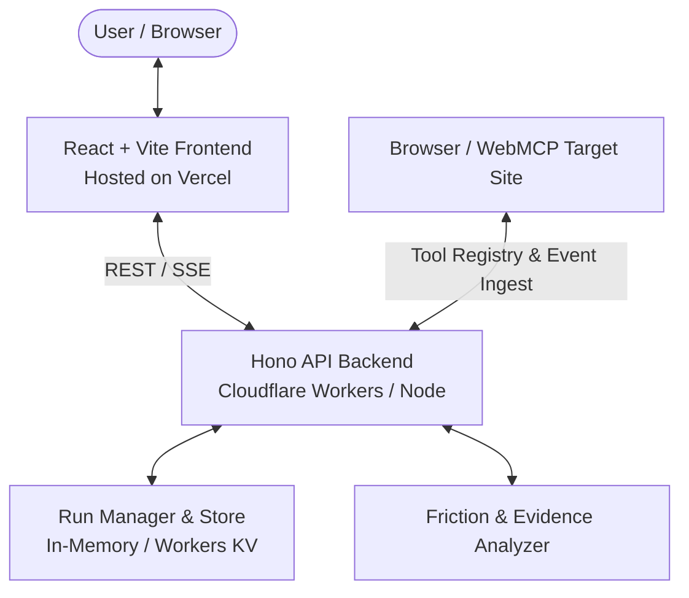

# Deep Age — Architecture & Technical Specification

## 1. Vision & Core Philosophy

Deep Age is designed from the ground up to answer the fundamental question:
> **"Give an agent a real task on a website. What actually happens?"**

Deep Age acts as the agent observability layer that inspects what capabilities an agent discovers, what tools it calls, what network requests/responses occur, what DOM elements exist, and where the agent experiences friction.

---

## 2. The 3 User Modes

| Mode | Target User | Key Questions & Purpose | Output Style |
|---|---|---|---|
| **Explore** | End-User / Non-Technical | "Why did checkout fail?", "Where did this price come from?", "What happened when I logged in?" | Plain-English summary first, with drill-down options |
| **Debug** | Product Owner / Developer | "Which tool failed?", "Are required WebMCP tools missing?", "What API endpoints were called?" | Technical trace, WebMCP schemas, DOM selectors, friction diagnostics & recommendations |
| **Inspect** | Security Analyst / Auditor | "What third-party domains were contacted?", "Was sensitive data leaked?", "Are there unencrypted calls?" | Factual observations of contacted domains, payloads, query parameters, and security signals |

---

## 3. Architecture Overview

### Components

1. **Frontend (`frontend/`)**:
   - React 18 + Vite + Tailwind CSS.
   - Start Screen: URL, Task prompt, 3-mode selector, quick demo triggers.
   - Results View: Status badge, summary metrics, plain-English "What happened?", and tabbed evidence viewers (WebMCP, Friction & Recommendations, Network, DOM, Security).

2. **Backend (`backend/`)**:
   - Hono web framework running on Cloudflare Workers / Node runtime.
   - Endpoints for test-drive lifecycle (`/api/test-drives`), event ingestion (`/api/test-drives/:id/events`), completion and analysis (`/api/test-drives/:id/complete`), and simulation (`/api/test-drives/:id/simulate`).

3. **Analysis Engine (`backend/src/analyzer.ts`)**:
   - Heuristics comparing discovered WebMCP tools with site capabilities (e.g. detecting missing `add_to_cart` tool when `POST /api/cart` or `button.btn-add-to-cart` exists).
   - Generates actionable recommendations backed by evidence.
   - Flags security signals for third-party host calls, unencrypted HTTP, or sensitive query parameters.

4. **Shared Types (`shared/`)**:
   - TypeScript definitions for `TestDriveRun`, `WebMCPTool`, `WebMCPToolCall`, `NetworkEvent`, `DOMInteractionEvent`, `ErrorEvent`, `AgentFriction`, and `SecuritySignal`.

5. **Demo E-Commerce Target (`demo/`)**:
   - Controlled mock store registering WebMCP tools on `window.modelContext` / `document.modelContext`.
   - Built-in capability toggle to demonstrate the Day 1 proof (friction state vs fixed state).
