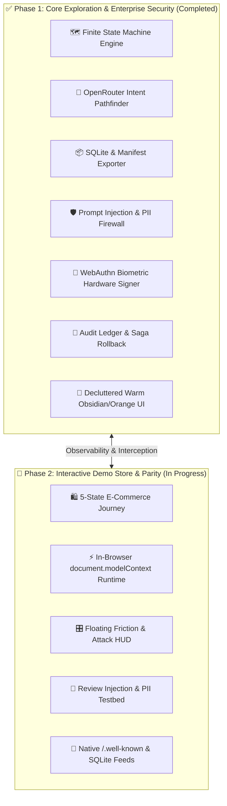

# Deep Age — Roadmap & Architecture Specification

A structured overview of the Deep-Age platform milestones, covering what has been completed (**Phase 1**) and the upcoming blueprint for the interactive demo store (**Phase 2**).

---

---

## 📌 Phase 1: Exploration Engine & Security Guardrails (Completed)

Phase 1 established the core modular subsystems for autonomous agent exploration, safety governance, and diagnostics.

### 1. Exploration & Intent Planning Subsystem
- **FSM State Graph Generator (`backend/src/engine/explore/state-graph.ts`)**:
  - Dynamically synthesizes the website's capability state graph from exposed WebMCP tools and DOM nodes.
  - Endpoints: `GET /api/explore/graph`, `GET /api/explore/snapshot`.
- **OpenRouter Intent Pathfinder (`backend/src/engine/explore/intent-resolver.ts`)**:
  - One-shot natural language intent resolver using OpenRouter LLM reasoning.
  - Resolves multi-step execution plans with safety tier categorizations (`public_read` $\to$ `reversible_write`).
  - **Zero Frontend Key Ingestion**: Handled 100% server-side via `process.env.OPENROUTER_API_KEY`.
- **Portable Knowledge & SQLite Exporter (`backend/src/engine/explore/catalog-exporter.ts`)**:
  - Exports downloadable `.sql` / SQLite files with pre-built FTS5 search indexes (`/api/explore/snapshot/sqlite`).
  - Generates official WebMCP JSON manifests (`/api/explore/snapshot/manifest`).

### 2. Enterprise Security & Privacy Guardrails
- **4-Tier WebMCP Safety Matrix**:
  - `Tier 0: public_read` (Product search, spec lookups — 0 confirmation required).
  - `Tier 1: context_read` (User orders, profile — requires session context).
  - `Tier 2: reversible_write` (Cart additions, coupons — requires saga compensation undo).
  - `Tier 3: critical_destructive` (Payments, account deletion — biometric passkey required).
- **Client-Side PII Masking Firewall (`backend/src/engine/security/pii-redactor.ts`)**:
  - Tokenizes sensitive data (emails, credit cards, phones, SSNs) before agent prompts or LLM ingestion.
- **Indirect Prompt Injection Shield (`backend/src/engine/security/injection-firewall.ts`)**:
  - Sandboxes untrusted DOM/review text and evaluates jailbreak heuristic scores.
- **WebAuthn Biometric Hardware Signer (`backend/src/engine/security/webauthn-signer.ts`)**:
  - Requires physical user presence (Touch ID / YubiKey) for critical transactions.
- **Tamper-Evident Audit Ledger & Rollback (`backend/src/engine/security/audit-ledger.ts`)**:
  - SHA-256 chained transaction ledger with instant one-click compensation rollbacks.

### 3. UI/UX Polish & Visual Cohesion
- Removed all unnecessary `Sparkles` and redundant icon clutter across the app.
- Standardized `#ff8527` orange pill buttons (`rounded-full`) and tab triggers.
- Re-architected the MCP Connection Dialog with clean tabs (`Remote SSE`, `Local Stdio`, `Endpoints`) and zero viewport overflow.

---

## 🚀 Phase 2: Interactive Demo Store Modernization & Parity (Next)

Phase 2 upgrades the Demo Store (`demo/`) from a single-toggle mockup into a full **WebMCP 2.0 Reference Application** to provide rich context and showcase the platform's features.

### 1. 5-Stage Multi-Step E-Commerce Lifecycle
The demo store will implement an explicit state machine:
1. **`ANONYMOUS_BROWSING`**: Tools: `search_products`, `filter_by_specs`, `get_categories`.
2. **`PRODUCT_DETAILS`**: Tools: `get_product_details`, `get_reviews`, `add_to_cart`.
3. **`CART_ACTIVE`**: Tools: `view_cart`, `update_quantity`, `apply_promo_code`.
4. **`CHECKOUT_GATEWAY`**: Tools: `set_shipping_address`, `authorize_payment`.
5. **`ORDER_CONFIRMED`**: Tools: `track_shipment`, `cancel_order`, `request_refund`.

### 2. In-Browser Dynamic WebMCP Runtime (`window.modelContext`)
- State-aware dynamic tool registration in `demo/src/public/app.js`.
- Automatic tool unregistration/registration when transitioning between browsing, cart, and checkout.
- Saga compensation handlers attached directly to reversible actions (`apply_promo_code` $\leftrightarrow$ `remove_promo_code`).

### 3. Interactive "Friction & Attack" Floating HUD
A top toolbar on `http://localhost:3002` allowing evaluators to inject real-world scenarios:
- **Missing Tool**: Turn off `add_to_cart` $\to$ triggers Deep-Age friction diagnostic and automated patch generator.
- **Schema Corruption**: Modify input schema $\to$ tests Deep-Age schema validator.
- **Review Jailbreak Honeypot**: Injects adversarial prompt injection reviews $\to$ tests Deep-Age Prompt Injection Shield.
- **PII Leak Form**: Shipping address with unmasked cards $\to$ tests Deep-Age PII Firewall.
- **Biometric Passkey Trigger**: Intercepts `authorize_payment` $\to$ triggers Deep-Age Passkey Modal.

### 4. Native Machine Exploration Feeds on Demo Server
- `GET /.well-known/webmcp.json`: Full manifest with JSON Schema specifications.
- `GET /api/state-graph`: JSON capability and transition graph.
- `GET /api/catalog.sqlite`: Downloadable SQLite database containing products, specs, and reviews.

---

## 📊 Summary Comparison: Phase 1 vs. Phase 2

| Dimension | Phase 1 (Platform Infrastructure) | Phase 2 (Demo Store Testbed) |
| :--- | :--- | :--- |
| **Primary Scope** | Main Deep-Age Engine & Frontend | Live Target Store (`demo/`) |
| **State Support** | FSM Generator, Graph Viewer, Intent Resolver | 5 Interactive E-Commerce States |
| **Security Layer** | PII Redactor, Injection Firewall, Passkey Verifier | Live Honeypots & Biometric Checkout Flow |
| **Developer Controls**| REPL, Virtual Sandbox, HAR Exporter | Floating "Friction & Attack" Lab HUD |
| **Verification** | Headless Chrome Sim & OpenRouter Live Test | End-to-End Real Agent E-Commerce Journeys |
